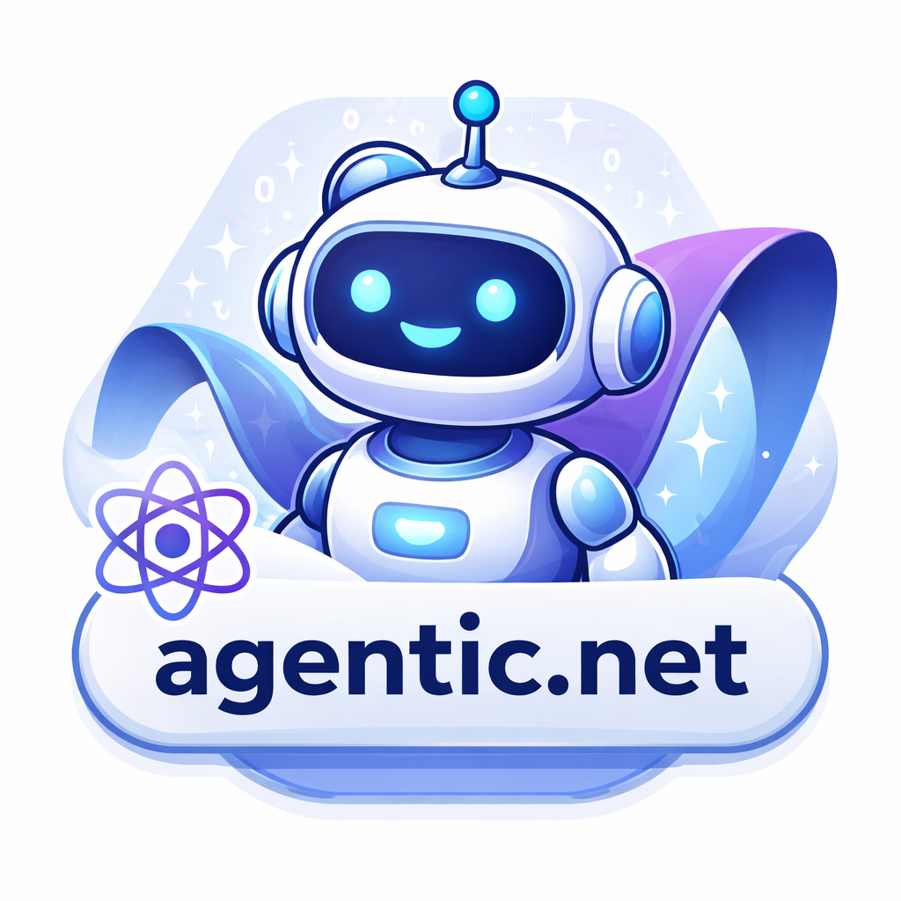

# Agentic.NET



Create AI assistants in .NET with pluggable models, memory, middleware, and tools.

The library exposes a minimal runtime with:

- `IAgentModel` abstraction for the underlying LLM or chat model
- optional memory (`IMemoryService`) with built-in SQLite and in‑memory providers
- middleware hooks (`IAssistantMiddleware`) to preprocess or postprocess conversation
- a tool‑calling mechanism (`ITool`) that the model can invoke

Designed for clarity and composability, the API lets your app stay in control while leveraging AI logic.

## Install

### NuGet (recommended for application developers)

The package is published on nuget.org and can be added by running:

```bash
dotnet add package Agentic.NET
```

NuGet clients (Visual Studio, Rider, CLI) will pull the compiled library and dependencies automatically.

## Minimal usage

```csharp
using Agentic.Builder;
using Agentic.Providers.OpenAi;

var apiKey = Environment.GetEnvironmentVariable("OPENAI_API_KEY")
    ?? throw new InvalidOperationException("Set OPENAI_API_KEY first.");

var model = Environment.GetEnvironmentVariable("OPENAI_MODEL") ?? OpenAiModels.Gpt4oMini;

var agent = new AgentBuilder()
    .WithOpenAi(apiKey, model)
    .Build();

var reply = await agent.ReplyAsync("Hello");
Console.WriteLine(reply);
```

## Custom model provider (optional)

If you need a non-OpenAI backend, implement your own provider:

```csharp
using Agentic.Abstractions;
using Agentic.Builder;
using Agentic.Core;

public sealed class DemoModelProvider : IModelProvider
{
    public IAgentModel CreateModel() => new DemoModel();
}

public sealed class DemoModel : IAgentModel
{
    public Task<AgentResponse> CompleteAsync(
        IReadOnlyList<ChatMessage> messages,
        CancellationToken cancellationToken = default)
    {
        var lastUser = messages.Last(m => m.Role == ChatRole.User).Content;
        return Task.FromResult(new AgentResponse($"Echo: {lastUser}"));
    }
}
```
## Typical integration pattern

1. Choose a model setup:
    - built-in OpenAI via `WithOpenAi(...)`, or
    - custom provider via `WithModelProvider(...)`.
2. Build an `Agent` with `AgentBuilder`.
3. Optionally add memory with `WithMemory(...)`.
4. Optionally add middleware with `UseMiddleware(...)`.
5. Optionally register tools with `WithTool(...)`.
6. Call `ReplyAsync(...)` from your app/service/controller.

## Key concepts

- `Agent`: runtime orchestrator for model, middleware, memory, and tools.
- `AgentContext`: current input + history + mutable working messages.
- `IAssistantMiddleware`: pipeline steps around model execution.
- `IMemoryService`: store/retrieve memory for context injection.
- `ITool`: executable function the model can request.

If memory is configured, `MemoryMiddleware` is added automatically unless you add your own memory middleware.

## Samples

Agentic.NET includes several runnable samples to demonstrate different features and integration patterns. Each sample includes a detailed README.md explaining what it demonstrates.

### Basic Chat (`samples/BasicChat`)

The simplest example showing how to create an agent with a custom model provider. Demonstrates:
- Basic `AgentBuilder` usage
- Implementing `IModelProvider` and `IAgentModel`
- Interactive chat loop with console input/output
- No external dependencies required

```bash
dotnet run --project samples/BasicChat/BasicChat.csproj
```

### Memory and Middleware (`samples/MemoryAndMiddleware`)

Shows how to add memory and custom middleware to enhance agent behavior. Demonstrates:
- Memory services with `IMemoryService`
- Custom middleware implementation with `IAssistantMiddleware`
- Context factory for additional processing
- Optional semantic embeddings for better memory recall

```bash
# Without embeddings
dotnet run --project samples/MemoryAndMiddleware/MemoryAndMiddleware.csproj

# With embeddings (requires OPENAI_API_KEY)
USE_EMBEDDINGS=true OPENAI_API_KEY=your_key dotnet run --project samples/MemoryAndMiddleware/MemoryAndMiddleware.csproj
```

### Tool Calling (`samples/ToolCalling`)

Demonstrates OpenAI function calling capabilities. Shows:
- Registering tools with the OpenAI provider
- Implementing `ITool` for executable functions
- How the model can invoke tools during conversations
- Interactive tool usage with a weather example

```bash
OPENAI_API_KEY=your_key dotnet run --project samples/ToolCalling/ToolCalling.csproj
```

### Personal Assistant (`samples/PersonalAssistant`)

A complete AI assistant with persistent memory and real OpenAI integration. Features:
- SQLite-based persistent conversation storage
- Optional semantic embeddings for enhanced recall
- Memory restoration across application restarts
- Full OpenAI Chat Completion API integration

```bash
# Without embeddings
OPENAI_API_KEY=your_key dotnet run --project samples/PersonalAssistant/PersonalAssistant.csproj

# With embeddings
USE_EMBEDDINGS=true OPENAI_API_KEY=your_key dotnet run --project samples/PersonalAssistant/PersonalAssistant.csproj
```

## Environment Variables

Samples that use OpenAI require the following environment variables:

- `OPENAI_API_KEY`: Your OpenAI API key (required for OpenAI samples)
- `OPENAI_MODEL`: Model to use (optional, defaults to `gpt-4o-mini`)
- `USE_EMBEDDINGS`: Set to `true` to enable semantic embeddings in memory samples (optional)

## Repository layout

- `Abstractions/` contracts and interfaces
- `Builder/` fluent `AgentBuilder`
- `Core/` runtime types and built-in memory implementations
- `Middleware/` middleware contracts and built-in memory middleware
- `Providers/OpenAi/` OpenAI provider implementation
- `samples/` runnable usage examples
- `tests/` unit tests